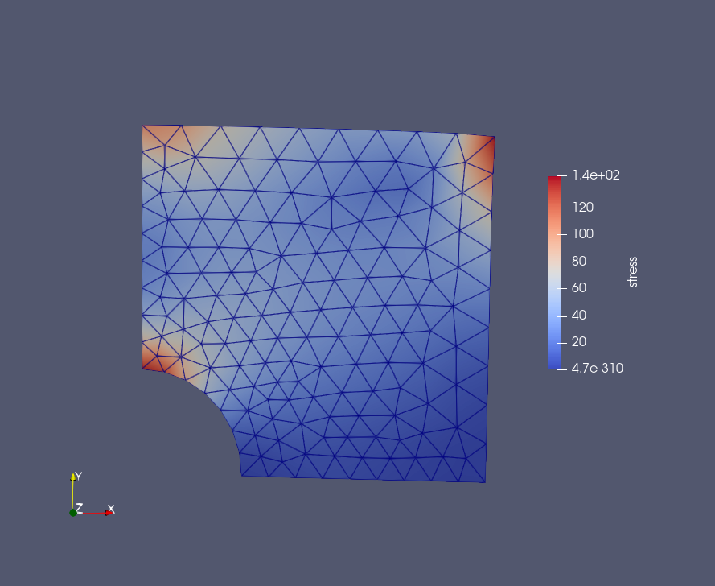

# fem_test
---
**input.inp** - входной файл.
  **mesh/** - папка с входным файлом \*.geo для сеткопостроителя GMSH и
файлом построенной сетки \*.mesh.
 **results/..** - папка с результатами.
 **src/..**
 *object.h* - массивы классов узлов, граничных и поверхностных (ячеек) элементов.
 *numerical.h* - численные параметры (масштабирование сетки).
 **src/paraview/..**
 *out.cpp* - генерация выходного файла для визуализатора Paraview.
 **src/reader/..**
 *read_input_file.cpp* - чтение входного файл input.inp.
 *construction_mesh.cpp* - построение связей между элементами (узлами, элементами).
 **src/solver/..**
 *boundary.cpp* - установка граничных для вектора внешних сил.
 *geometry.cpp* - вычисление площади элемента и элементов матрицы Коши [1].
 *linalg.cpp* - вычисление СЛАУ Ku=F методом LU-разложения (Вабищевич) [2].
 *shift.cpp* -  определение матрицы Гука, расчёт матриц локальной и глобальной жёсткости K (Отсутствует алгоритм работы с разреженными матрицами. Вычисления проводятся в рамках плотных матриц!).
 *solver.cpp* - файл поэтапного вызова главных расчётных функций.
 *stress_value.cpp* - вычисление элементов тензора деформаций и напряжений для каждой ячейки расчётной сетки.

 [1]. Павленко И.В. Метод конечных элементов в задачах сопротивления материалов и линейной теории упругости. 2006.
 [2]. П.Н. Вабищевич. Численные методы. Вычислительный практикум при использовании алгоритмического языка Python. 2010.

---

